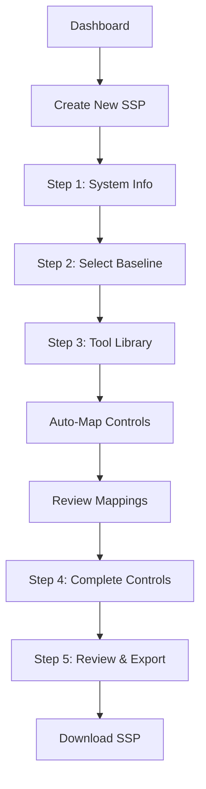
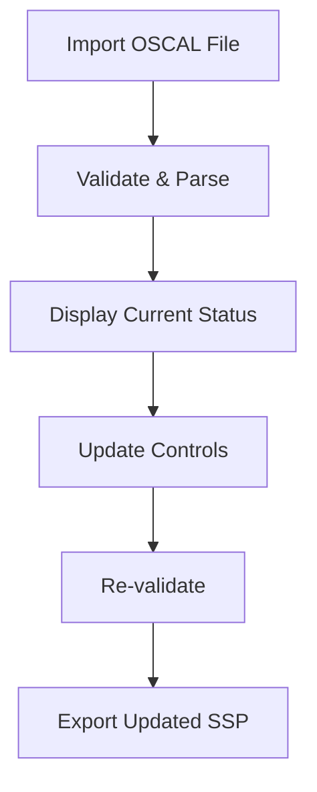

# SSP Generator UX Design Specification

_Created on 2025-11-26 by USER_
_Generated using BMad Method - Create UX Design Workflow v1.0_

---

## Executive Summary

The SSP Generator democratizes NIST 800-53 and FedRAMP compliance by making System Security Plan (SSP) creation accessible to both **compliance officers** (intuitive web UI) and **software engineers** (CLI for automation).

**Core UX Philosophy:** Users should feel like the tool **speeds up authorization**, not slows them down. They should **approve pre-filled suggestions** rather than write from scratch, and **never input the same data twice**.

**Design System:** shadcn/ui (built on Radix UI primitives + Tailwind CSS)
- Accessibility-first (WCAG 2.1 AA compliant)
- Professional, government-appropriate aesthetic
- Full source code ownership for compliance customization

---

## 1. Design System Foundation

### 1.1 Design System Choice

**Selected:** shadcn/ui

**Rationale:**
- Built on Radix UI primitives providing WCAG-compliant accessibility out of the box
- Tailwind CSS enables fast iteration and consistent spacing
- Source code ownership allows deep customization for compliance domain
- Professional, minimal aesthetic fits GovTech expectations
- Complete component coverage: wizards, forms, tables, cards, modals, toasts

**Components from shadcn/ui:**
- Navigation (sidebar, breadcrumbs, tabs)
- Forms (inputs, selects, checkboxes, radio groups)
- Data display (tables, cards, badges, progress)
- Feedback (alerts, toasts, dialogs)
- Layout (accordion, collapsible, separator)

**Custom Components Needed:**
- Control Status Badge (Implemented/Partial/Planned/Not Applicable)
- Tool Library Card (with control mapping preview)
- Implementation Statement Card (with AI confidence indicator)
- Approval Action Bar (Approve/Modify/Reject)
- SSP Progress Ring (control family completion)

---

## 2. Core User Experience

### 2.1 Target Users & Their Needs

**Persona 1: Compliance Officer (Primary Web UI User)**
- Non-technical background
- Needs guided, step-by-step workflows
- Values: Clear progress, no jargon, confidence in output
- Pain point: Overwhelmed by 400+ controls, manual documentation

**Persona 2: Software Engineer (Primary CLI User)**
- Technical background, DevSecOps mindset
- Needs scriptable, automatable workflows
- Values: Speed, Git-friendly output, CI/CD integration
- Pain point: Compliance work feels like overhead, not engineering

### 2.2 Defining Experience

> **"It's the tool where you pick your security tools and it pre-fills your compliance documentation"**

**Analogies:**
- TurboTax: Answer questions → pre-filled forms → review → file
- Terraform: Plan → see changes → approve → apply
- GitHub PR Templates: Pre-filled content you customize

**Core UX Pattern:** Selection → Auto-Mapping → Approval → Export

### 2.3 Core Experience Principles

| Principle | Approach | Implementation |
|-----------|----------|----------------|
| **Speed** | Pre-fill everything possible | Tool library auto-maps controls and statements |
| **No Repetition** | Smart data reuse | System info entered once, propagates everywhere |
| **Guidance** | Wizard for new users | Step-by-step flow with progress indicators |
| **Flexibility** | Advanced mode for power users | Skip steps, bulk operations, direct editing |
| **Trust** | Transparent AI | Show confidence levels, reasoning, sources |
| **Feedback** | Celebratory completion | Progress rings, milestone celebrations |

### 2.4 Desired Emotional Response

Users should feel:
1. **Accelerated** - "This is way faster than doing it manually"
2. **Smart** - "The tool knows what I need before I ask"
3. **Confident** - "I can see why it suggested this control mapping"
4. **Productive** - "I'm approving and moving forward, not stuck writing"
5. **In Control** - "I can modify anything, nothing is locked"

### 2.5 Novel UX Pattern: Tool-to-Control Auto-Mapping

This is the signature UX pattern that differentiates SSP Generator.

**Pattern Name:** Tool Library Selection with Pre-Mapped Controls

**User Goal:** Rapidly document control implementations based on security tools already in use

**Flow:**
```
1. User opens Tool Library
2. User selects tools in use (e.g., semgrep, Trivy, Gitleaks)
3. System displays pre-mapped controls for each tool
4. For each mapping:
   - Shows control ID and title
   - Shows pre-written implementation statement
   - Shows confidence level (High/Medium/Low)
   - Shows source (community, vendor, custom)
5. User actions per mapping:
   - [Approve] → Adds to SSP with "AI-assisted" badge
   - [Modify] → Opens editor to customize, then approve
   - [Reject] → Skips this mapping
6. Approved mappings appear in control implementation section
```

**Visual Elements:**
- **Tool Card**: Logo, name, description, "X controls mapped" badge
- **Mapping Card**: Control ID, statement preview, confidence bar, action buttons
- **Confidence Indicator**:
  - High (green) = "Based on vendor documentation + community validation"
  - Medium (yellow) = "Based on common usage patterns"
  - Low (orange) = "Generic suggestion, review carefully"

**States:**
- Default: Tool unselected, grayed controls
- Selected: Tool highlighted, mapped controls revealed
- Approved: Green checkmark, moves to "Implemented" section
- Modified: Blue edit badge, preserves original for reference
- Rejected: Hidden from view (can restore later)

**Future Enhancement (Stretch Goal):**
- Community contributions for tool mappings
- User can submit new mappings for review
- Crowdsourced improvement of suggestions

---

## 3. Visual Foundation

### 3.1 Color System

**Selected Theme: Federal Blue**

The Federal Blue theme provides the most appropriate trust signals for GovTech compliance software while maintaining modern aesthetics. Blue is universally associated with trust, authority, and reliability - essential attributes for government-focused software.

**Primary Palette:**
| Color | Hex | Usage |
|-------|-----|-------|
| Primary | #1d4ed8 | Main actions, navigation highlights, links |
| Primary Dark | #1e40af | Hover states, active elements |
| Primary Light | #3b82f6 | Secondary emphasis |
| Primary BG | #dbeafe | Highlighted sections, selected states |

**Semantic Colors:**
| Purpose | Hex | Usage |
|---------|-----|-------|
| Success | #22c55e | Implemented controls, approved items, completion |
| Success BG | #dcfce7 | Success badges, notifications |
| Warning | #f59e0b | Partial implementation, needs attention |
| Warning BG | #fef3c7 | Warning badges, alerts |
| Error | #ef4444 | Not applicable, rejected, validation errors |
| Error BG | #fee2e2 | Error badges, alerts |
| Info | #3b82f6 | Planned controls, informational badges |
| Info BG | #dbeafe | Info badges, highlights |

**Neutral Scale (Slate):**
| Token | Hex | Usage |
|-------|-----|-------|
| neutral-50 | #f8fafc | Page backgrounds |
| neutral-100 | #f1f5f9 | Card backgrounds, alternating rows |
| neutral-200 | #e2e8f0 | Borders, dividers |
| neutral-300 | #cbd5e1 | Disabled elements |
| neutral-400 | #94a3b8 | Placeholder text |
| neutral-500 | #64748b | Secondary text |
| neutral-600 | #475569 | Body text |
| neutral-700 | #334155 | Headings |
| neutral-800 | #1e293b | Sidebar background |
| neutral-900 | #0f172a | Primary text |

**WCAG Compliance:** All primary/semantic colors meet WCAG 2.1 AA contrast requirements (4.5:1 minimum for normal text).

**Interactive Visualization:** [ux-color-themes.html](./ux-color-themes.html)

### 3.2 Typography

**Font Strategy:** System fonts for performance and government network compatibility

```css
--font-sans: system-ui, -apple-system, BlinkMacSystemFont, "Segoe UI", Roboto, sans-serif;
--font-mono: ui-monospace, "Cascadia Code", "Source Code Pro", Menlo, monospace;
```

**Scale:**
- Display: 2.25rem (36px) - Dashboard titles
- H1: 1.875rem (30px) - Page titles
- H2: 1.5rem (24px) - Section headers
- H3: 1.25rem (20px) - Subsection headers
- Body: 1rem (16px) - Standard text
- Small: 0.875rem (14px) - Labels, captions
- Tiny: 0.75rem (12px) - Badges, metadata

### 3.3 Spacing & Layout

**Base Unit:** 4px (Tailwind default)

**Spacing Scale:**
- xs: 4px (gap between inline elements)
- sm: 8px (tight padding)
- md: 16px (standard padding)
- lg: 24px (section spacing)
- xl: 32px (page margins)
- 2xl: 48px (major section breaks)

**Layout Grid:**
- Desktop: 12-column grid, max-width 1280px
- Tablet: 8-column grid
- Mobile: 4-column grid

**Interactive Visualizations:**
- Color Theme Explorer: [ux-color-themes.html](./ux-color-themes.html)

---

## 4. Design Direction

### 4.1 Chosen Design Approach

**Selected: Hybrid Approach - Combining Best Elements**

After exploring 6 design directions (see [ux-design-directions.html](./ux-design-directions.html)), the recommended approach combines elements from multiple directions to serve both user personas optimally:

| Screen/Flow | Design Direction | Rationale |
|-------------|------------------|-----------|
| **Dashboard** | Dense Dashboard (#1) | Power users need quick access to all SSPs and stats |
| **SSP Creation** | Spacious Wizard (#2) | Guided experience reduces overwhelm for compliance officers |
| **Tool Library & Approval** | Split Panel (#5) | Master-detail layout ideal for review/approve workflow |
| **Control Catalog** | Card Gallery (#3) | Visual browsing helps users find controls quickly |
| **Power User Features** | Command First (#6) | Keyboard shortcuts (⌘K) for developer efficiency |

**Design Direction Summary:**

**Primary Layout Pattern:** Sidebar + Main Content
- Fixed sidebar navigation (collapsible on tablet/mobile)
- Main content area adapts based on context
- Breadcrumbs for navigation context

**Information Density:** Adaptive
- Dense for dashboard and data views
- Spacious for creation and editing flows
- Progressive disclosure throughout

**Visual Hierarchy:**
- Bold headers for page titles
- Card-based content organization
- Clear visual separation between sections

**Interaction Patterns:**
- Wizard flow for multi-step creation
- Inline editing where possible
- Modal for focused tasks (approve/reject)
- Command palette for power users

**Key Screens Defined:**

1. **Dashboard** - Stats overview, SSP list, quick actions
2. **Create SSP Wizard** - 5-step guided flow
3. **Tool Library** - Grid of tools with mapping preview
4. **Approval Queue** - Split panel with list + preview
5. **Control Catalog** - Filterable card grid
6. **SSP Detail** - Progress rings + control family tabs
7. **Export** - Format selection + preview

**Interactive Mockups:** [ux-design-directions.html](./ux-design-directions.html)

---

## 5. User Journey Flows

### 5.1 Critical User Paths

**Journey 1: Create New SSP (Compliance Officer - Web UI)**



**Step Details:**

| Step | User Action | System Response | Key UX |
|------|-------------|-----------------|--------|
| 1 | Enter system name, description, boundary | Auto-saves | Inline help, no jargon |
| 2 | Select baseline (Low/Moderate/High/FedRAMP) | Load applicable controls | Clear comparison |
| 3 | Select tools from library | Pre-map controls | Tool cards with mapping count |
| 4 | Review/approve auto-mapped controls | Update implementation status | Approval workflow, bulk actions |
| 5 | Complete remaining controls | Track progress by family | Progress ring, skip options |
| 6 | Review full SSP, export | Generate OSCAL/Word/PDF | Format comparison, validation |

**Journey 2: Quick SSP Update (Engineer - CLI)**

```bash
# Engineer workflow
ssp init --baseline moderate --name "My System"
ssp tool add semgrep trivy gitleaks  # Auto-maps controls
ssp control review                    # Interactive approval
ssp validate                          # Check OSCAL compliance
ssp export --format oscal-json        # Export for CI/CD
```

**Journey 3: Import & Update Existing SSP**



---

## 6. Component Library

### 6.1 Component Strategy

**From shadcn/ui (use as-is):**
- Button (primary, secondary, ghost, destructive)
- Input, Textarea, Select, Checkbox, Radio
- Card, Badge, Alert, Toast
- Dialog, Sheet, Popover, Tooltip
- Table, Tabs, Accordion
- Progress, Skeleton
- Command (command palette for quick navigation)

**Custom Components:**

#### Control Status Badge
Shows implementation status with semantic color.

| Status | Color | Icon |
|--------|-------|------|
| Implemented | Green | Check circle |
| Partial | Yellow | Half circle |
| Planned | Blue | Clock |
| Not Applicable | Gray | Minus circle |
| Not Started | Light gray | Empty circle |

#### Tool Library Card
```
┌─────────────────────────────────────────┐
│ [Logo] Tool Name                   [+]  │
│ Brief description of the tool           │
│ ─────────────────────────────────────── │
│ 12 controls mapped • High confidence    │
│ [Preview Mappings]                      │
└─────────────────────────────────────────┘
```

#### Implementation Statement Card
```
┌─────────────────────────────────────────┐
│ AC-2(1) Account Management              │
│ ─────────────────────────────────────── │
│ Implementation Statement:               │
│ "Trivy scans container images for..."   │
│ ─────────────────────────────────────── │
│ Confidence: ████████░░ High             │
│ Source: Trivy vendor docs               │
│ ─────────────────────────────────────── │
│ [Approve]  [Modify]  [Reject]           │
└─────────────────────────────────────────┘
```

#### SSP Progress Ring
Circular progress indicator showing control family completion.
- Shows X/Y controls completed
- Color indicates status (all green = done, mixed = in progress)
- Click to drill into family

#### Approval Action Bar
Sticky bar at bottom when reviewing multiple items.
- "X items selected"
- [Approve All] [Reject All] [Clear Selection]

---

## 7. UX Pattern Decisions

### 7.1 Consistency Rules

**Button Hierarchy:**
- Primary (solid blue): Main action per screen (e.g., "Next", "Approve")
- Secondary (outline): Alternative actions (e.g., "Back", "Skip")
- Ghost (text): Tertiary actions (e.g., "Cancel", "Clear")
- Destructive (red): Dangerous actions (e.g., "Delete SSP")

**Feedback Patterns:**
- Success: Toast notification (top-right, auto-dismiss 5s)
- Error: Inline below input + toast for form submission errors
- Loading: Skeleton loaders for content, spinner for actions
- Progress: Progress bar in wizard, ring for control completion

**Form Patterns:**
- Labels: Above inputs (not floating)
- Required: Asterisk (*) with "Required" legend
- Validation: On blur for individual fields, on submit for form
- Errors: Inline below field with red text and icon
- Help text: Below input in gray, expandable for long help

**Modal Patterns:**
- Confirmation modals for destructive actions
- Sheet (slide-out) for editing implementation statements
- Dialog for quick actions (approve mapping)
- Full-screen for complex multi-step flows

**Navigation Patterns:**
- Active state: Bold text + colored left border (sidebar)
- Breadcrumbs: On all pages except dashboard
- Back button: Uses browser back when possible

**Empty State Patterns:**
- First use: Illustration + "Get Started" CTA
- No results: Helpful message + clear filters option
- No content: Ghost state showing what will appear

**Confirmation Patterns:**
- Delete: Always confirm with modal
- Leave unsaved: Warning modal + "Save Draft" option
- Bulk reject: Confirm with count of affected items

---

## 8. Responsive Design & Accessibility

### 8.1 Responsive Strategy

**Breakpoints:**
- Mobile: <640px (single column, hamburger menu)
- Tablet: 640-1024px (collapsible sidebar, 2-column)
- Desktop: >1024px (persistent sidebar, 3-column layouts)

**Adaptation Patterns:**
| Element | Desktop | Tablet | Mobile |
|---------|---------|--------|--------|
| Navigation | Fixed sidebar | Collapsible sidebar | Hamburger menu |
| Wizard | Horizontal steps | Vertical steps | Vertical accordion |
| Control table | Full table | Scrollable table | Card stack |
| Tool library | Grid (3 columns) | Grid (2 columns) | Single column |
| Approval bar | Floating bottom | Floating bottom | Full-width fixed |

### 8.2 Accessibility Strategy

**Target:** WCAG 2.1 Level AA (required for government/GovTech)

**Key Requirements:**
- Color contrast: 4.5:1 minimum (text), 3:1 (large text/UI)
- Keyboard navigation: All interactive elements accessible via Tab
- Focus indicators: Visible focus ring on all focusable elements
- ARIA labels: Meaningful labels for screen readers
- Alt text: Descriptive text for all meaningful images
- Form labels: Properly associated with inputs
- Error identification: Clear, descriptive error messages
- Touch targets: Minimum 44x44px on mobile

**Testing Strategy:**
- Automated: Lighthouse, axe DevTools in CI/CD
- Manual: Keyboard-only navigation testing
- Screen reader: NVDA/VoiceOver testing

---

## 9. Implementation Guidance

### 9.1 Development Priorities

**Phase 1: Core Infrastructure**
- Set up shadcn/ui with custom theme
- Implement layout (sidebar, header, main content)
- Build wizard component framework

**Phase 2: SSP Creation Flow**
- System info form
- Baseline selection
- Control catalog browsing
- Export functionality

**Phase 3: Tool Library & Auto-Mapping (Differentiator)**
- Tool library UI
- Auto-mapping engine integration
- Approval workflow components
- Implementation statement editor

**Phase 4: Polish & Accessibility**
- WCAG 2.1 AA audit and fixes
- Responsive refinements
- Animation and micro-interactions
- Performance optimization

### 9.2 Completion Summary

**UX Design Specification Complete**

This document establishes the complete UX foundation for SSP Generator:

| Component | Decision | Rationale |
|-----------|----------|-----------|
| **Design System** | shadcn/ui | Accessibility-first, Tailwind-based, source ownership |
| **Color Theme** | Federal Blue | Trust signals for GovTech, WCAG AAA compliant |
| **Typography** | System fonts | Performance, government network compatibility |
| **Layout** | Hybrid approach | Dense dashboard + spacious wizard + split panel approval |
| **Accessibility** | WCAG 2.1 AA | Required for government users |

**Core Deliverables Created:**
- UX Design Specification: `docs/ux-design-specification.md` (this document)
- Color Theme Visualizer: `docs/ux-color-themes.html`
- Design Direction Mockups: `docs/ux-design-directions.html`

**Key UX Innovations:**
1. **Tool-to-Control Auto-Mapping** - Users select security tools, system pre-fills implementation statements
2. **Approval Workflow** - Users approve/modify/reject suggestions rather than write from scratch
3. **Dual-Interface Support** - Same core experience for both Web UI and CLI users
4. **Confidence Indicators** - AI suggestions show confidence levels and sources for transparency

**Ready for Next Phase:**
- Architecture design (technical implementation)
- Epic and story breakdown (development planning)
- Interactive prototyping (user testing)

---

## Appendix

### Related Documents

- Product Requirements: `docs/prd.md`
- Research Summary: `docs/research-ssp-generator-2025-11-26.md`

### Core Interactive Deliverables

This UX Design Specification will be accompanied by:

- **Color Theme Visualizer**: `docs/ux-color-themes.html`
  - Interactive HTML showing all color theme options explored
  - Live UI component examples in each theme
  - Side-by-side comparison and semantic color usage

- **Design Direction Mockups**: `docs/ux-design-directions.html`
  - Interactive HTML with 6-8 complete design approaches
  - Full-screen mockups of key screens
  - Design philosophy and rationale for each direction

### Next Steps & Follow-Up Workflows

This UX Design Specification can serve as input to:

- **Architecture Workflow** - Define technical architecture with UX context
- **Epic/Story Creation** - Break down into implementable units
- **Interactive Prototype** - Build clickable HTML prototype
- **AI Frontend Prompt** - Generate prompts for v0, Lovable, Bolt

### Version History

| Date | Version | Changes | Author |
|------|---------|---------|--------|
| 2025-11-26 | 1.0 | Complete UX Design Specification - All sections finalized | USER |
| 2025-11-26 | 0.1 | Initial UX Design Specification - Core sections | USER |

---

_This UX Design Specification was created through collaborative design facilitation. All decisions were made with user input and are documented with rationale._
